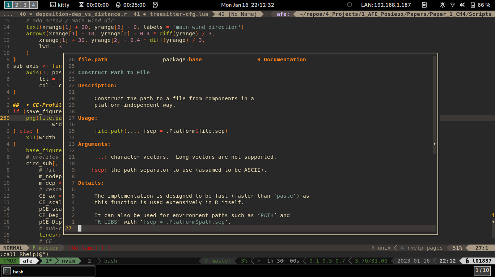

# floating-nvim-rhelp

Use 'K' to open a floating window displaying the R help pages for the word under the cursor.



Copy the syntax files into a "syntax" directory in your runtimepath (e.g. ~/.config/nvim/syntax)
and source the floating-rhelp.vim file from your vimrc.

Add the following mapping to your vimrc:
```vimscript
" map K to call Rhelp
autocmd FileType r <buffer> K yiw:call Rhelp(@")<CR>
```

